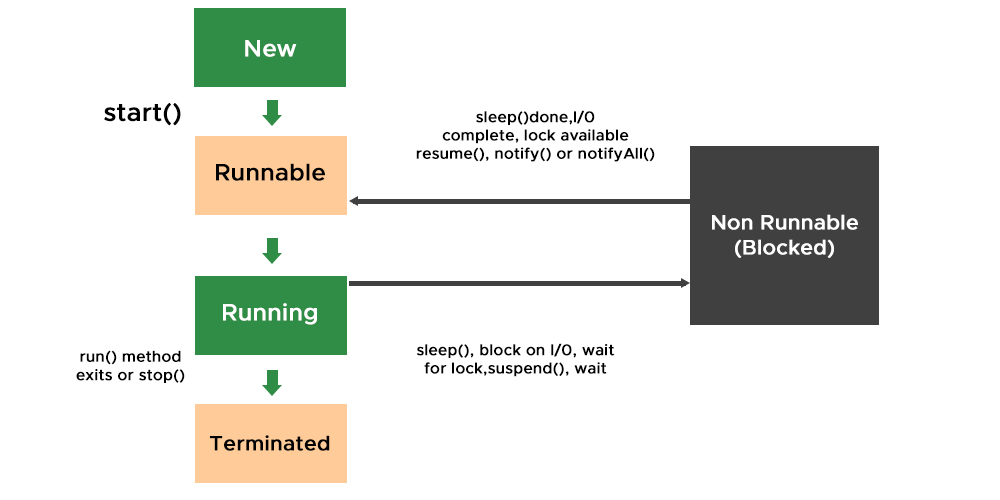

# Multithreading in Java

## Table of Contents

- [Multithreading in Java](#multithreading-in-java)
  - [Table of Contents](#table-of-contents)
  - [Introduction](#introduction)
  - [Benefits of Multithreading](#benefits-of-multithreading)
  - [Creating Threads](#creating-threads)
    - [Extending the Thread Class](#extending-the-thread-class)
    - [Implementing the Runnable Interface](#implementing-the-runnable-interface)
  - [Thread Lifecycle](#thread-lifecycle)
  - [Thread Synchronization](#thread-synchronization)
  - [Thread Pools](#thread-pools)
  - [Concurrency Utilities](#concurrency-utilities)
  - [Best Practices](#best-practices)

## Introduction

Multithreading is a concurrent execution of more than one sequential set of instructions. In Java, multithreading can be achieved by creating and managing multiple threads. This allows different parts of a program to run concurrently, improving performance and responsiveness.

## Benefits of Multithreading

- **Parallelism:** Execute multiple tasks simultaneously, utilizing available resources efficiently.
- **Responsiveness:** Improve the responsiveness of applications, especially in user interfaces.
- **Performance:** Enhance the overall performance by utilizing the available resources effectively.

## Creating Threads

### Extending the Thread Class

```java
class MyThread extends Thread {
    public void run() {
        // Code to be executed in the new thread
    }

    public static void main(String[] args) {
        MyThread myThread = new MyThread();
        myThread.start();
    }
}
```

### Implementing the Runnable Interface

```java
class MyRunnable implements Runnable {
    public void run() {
        // Code to be executed in the new thread
    }

    public static void main(String[] args) {
        Thread myThread = new Thread(new MyRunnable());
        myThread.start();
    }
}
```

## Thread Lifecycle

Threads in Java go through various states: New, Runnable, Blocked, Waiting, Timed Waiting, and Terminated. Understanding the lifecycle is crucial for effective thread management.


## Thread Synchronization

Ensure proper synchronization to avoid data inconsistencies and race conditions. Use synchronized keyword, locks, or other synchronization mechanisms.

## Thread Pools

Thread pools manage a pool of worker threads to execute tasks. This helps in reusing threads, reducing overhead, and improving performance.

## Concurrency Utilities

Java provides several utility classes in the java.util.concurrent package for simplifying multithreaded programming, such as ExecutorService, Future, and Semaphore.

## Best Practices

Minimize the use of global variables in multithreaded programs.
Use thread-safe data structures.
Be cautious with locks to prevent deadlocks.
